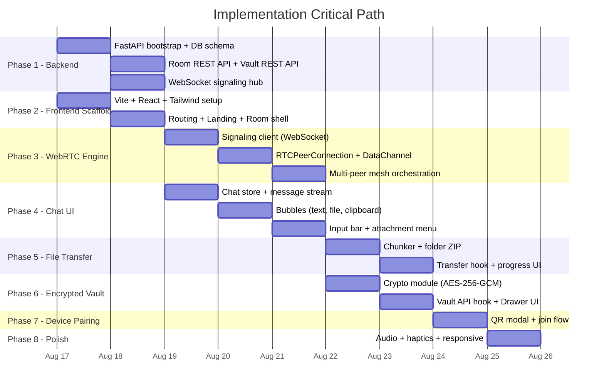

# Implementation Plan: NEXUS_P2P

> Cross-Device P2P Hub & Encrypted Vault
> **Reference:** [spec.md](file:///D:/AI%20&%20ML/Projects/P2P/spec.md) · **Demo:** [demo.html](file:///D:/AI%20&%20ML/Projects/P2P/demo.html)

---

## Project Structure

```
P2P/
├── backend/                       # Python FastAPI Server
│   ├── main.py                    # FastAPI app entry point (Uvicorn)
│   ├── config.py                  # App settings (CORS origins, STUN/TURN URLs, DB path)
│   ├── database.py                # SQLite setup (aiosqlite), table schemas, migrations
│   ├── models.py                  # Pydantic models (Room, VaultItem, SignalMessage, Device)
│   ├── routes/
│   │   ├── rooms.py               # REST: create room, join room, verify passphrase
│   │   └── vault.py               # REST: CRUD encrypted vault items (notes + files ≤10MB)
│   ├── signaling.py               # WebSocket endpoint: SDP offer/answer, ICE candidate relay
│   └── requirements.txt           # fastapi, uvicorn, aiosqlite, python-multipart
│
├── frontend/                      # React + TypeScript + Tailwind (Vite)
│   ├── index.html
│   ├── vite.config.ts
│   ├── tailwind.config.ts         # Custom theme tokens (cyber palette)
│   ├── tsconfig.json
│   ├── package.json
│   ├── public/
│   │   └── favicon.svg
│   └── src/
│       ├── main.tsx               # React root + router mount
│       ├── App.tsx                 # Top-level layout + route definitions
│       ├── index.css              # Tailwind directives + global styles
│       │
│       ├── types/                 # Shared TypeScript interfaces
│       │   ├── signaling.ts       # SignalMessage, SDPPayload, ICEPayload
│       │   ├── room.ts            # Room, Device, PeerInfo
│       │   ├── vault.ts           # VaultNote, VaultFile, EncryptedBlob
│       │   └── transfer.ts        # TransferMeta, ChunkHeader, TransferProgress
│       │
│       ├── lib/                   # Core logic modules (non-React)
│       │   ├── webrtc.ts          # RTCPeerConnection management, DataChannel setup
│       │   ├── signaling.ts       # WebSocket client, send/receive signal messages
│       │   ├── crypto.ts          # AES-256-GCM encrypt/decrypt, PBKDF2 key derivation
│       │   ├── chunker.ts         # File → chunk splitter (64KB chunks), reassembly
│       │   ├── folder-zip.ts      # In-browser folder → ZIP stream (using fflate)
│       │   ├── device-detect.ts   # Auto-detect device type + default nickname
│       │   └── audio.ts           # Web Audio API synthesized sci-fi chimes
│       │
│       ├── hooks/                 # React custom hooks
│       │   ├── useSignaling.ts    # WebSocket lifecycle, reconnection, message dispatch
│       │   ├── usePeers.ts        # Multi-peer WebRTC connection state management
│       │   ├── useTransfer.ts     # File send/receive progress tracking
│       │   └── useVault.ts        # Vault CRUD API calls + client-side decrypt/encrypt
│       │
│       ├── stores/                # Lightweight state (Zustand or React Context)
│       │   ├── roomStore.ts       # Current room, passphrase, peer list
│       │   └── chatStore.ts       # Chat message history (ephemeral, in-memory)
│       │
│       ├── components/            # UI Components
│       │   ├── layout/
│       │   │   ├── Header.tsx     # Top bar: room badge, device name, pair button
│       │   │   ├── PeerStrip.tsx  # Connected device pills under header
│       │   │   └── InputBar.tsx   # Bottom input: message field, attach menu, clipboard btn
│       │   │
│       │   ├── chat/
│       │   │   ├── ChatView.tsx   # Scrollable message stream container
│       │   │   ├── TextBubble.tsx # Plain text message bubble (sent/received variants)
│       │   │   ├── FileBubble.tsx # File/image/video attachment bubble with download btn
│       │   │   ├── TransferBubble.tsx  # Active streaming file with progress bar + speed
│       │   │   ├── ClipboardBubble.tsx # Clipboard paste snippet bubble
│       │   │   └── DateDivider.tsx     # "Today" / date separator
│       │   │
│       │   ├── vault/
│       │   │   ├── VaultDrawer.tsx     # Slide-out right sidebar for vault items
│       │   │   ├── VaultNoteCard.tsx   # Encrypted note card (view/copy/edit/delete)
│       │   │   └── VaultFileCard.tsx   # Encrypted file card (download/delete)
│       │   │
│       │   ├── modals/
│       │   │   ├── PairDeviceModal.tsx # QR code + room code + copy link modal
│       │   │   ├── CreateRoomModal.tsx # Create new room with passphrase
│       │   │   └── JoinRoomModal.tsx   # Join existing room via code/passphrase
│       │   │
│       │   └── shared/
│       │       ├── Toast.tsx      # Bottom-center toast notification
│       │       ├── AttachMenu.tsx # Popover: file, folder, photo, camera, screen
│       │       └── ProgressBar.tsx # Reusable animated progress bar
│       │
│       └── pages/
│           ├── LandingPage.tsx    # Create or Join a room (entry point)
│           └── RoomPage.tsx       # Main chat + vault room view
│
├── spec.md
├── PLAN.md
└── demo.html
```

---

## Implementation Phases

### Phase 1 — Backend Foundation
> FastAPI server with WebSocket signaling + SQLite persistence

#### 1.1 Project Bootstrap & Dependencies
- [ ] Create `backend/` directory
- [ ] Create `requirements.txt`:
  ```
  fastapi>=0.115
  uvicorn[standard]
  aiosqlite
  python-multipart
  ```
- [ ] Set up `config.py` with app settings:
  - CORS allowed origins (localhost + production)
  - Google free STUN server URLs (`stun:stun.l.google.com:19302`)
  - SQLite database file path (`./nexus.db`)

#### 1.2 Database Layer (`database.py`)
- [ ] Initialize async SQLite connection (aiosqlite)
- [ ] Create tables on startup:

  ```sql
  -- Persistent rooms
  CREATE TABLE IF NOT EXISTS rooms (
      id TEXT PRIMARY KEY,              -- Room short code (e.g., "cyber-7429")
      passphrase_hash TEXT NOT NULL,    -- bcrypt/scrypt hash of room passphrase
      created_at TIMESTAMP DEFAULT CURRENT_TIMESTAMP
  );

  -- Encrypted vault items (notes + small files)
  CREATE TABLE IF NOT EXISTS vault_items (
      id TEXT PRIMARY KEY,              -- UUID
      room_id TEXT NOT NULL,            -- FK → rooms.id
      type TEXT NOT NULL,               -- "note" | "file"
      title TEXT NOT NULL,              -- Plaintext title (or encrypted title)
      encrypted_data BLOB NOT NULL,     -- AES-256-GCM ciphertext
      iv TEXT NOT NULL,                 -- Initialization vector (hex)
      file_size INTEGER,               -- Original size in bytes (for files)
      file_name TEXT,                   -- Original filename (for files)
      created_at TIMESTAMP DEFAULT CURRENT_TIMESTAMP,
      updated_at TIMESTAMP DEFAULT CURRENT_TIMESTAMP,
      FOREIGN KEY (room_id) REFERENCES rooms(id)
  );
  ```

#### 1.3 Pydantic Models (`models.py`)
- [ ] `RoomCreate` — passphrase input for room creation
- [ ] `RoomJoin` — room_id + passphrase for joining
- [ ] `VaultItemCreate` — type, title, encrypted_data (base64), iv
- [ ] `VaultItemResponse` — id, type, title, encrypted_data, iv, file_size, timestamps
- [ ] `SignalMessage` — type (offer/answer/ice/join/leave), sender_id, payload, room_id

#### 1.4 REST Routes — Rooms (`routes/rooms.py`)
- [ ] `POST /api/rooms` — Create a new room, hash passphrase, return room_id + short code
- [ ] `POST /api/rooms/{room_id}/join` — Verify passphrase, return room metadata
- [ ] `GET /api/rooms/{room_id}/peers` — List currently connected peer device names

#### 1.5 REST Routes — Vault (`routes/vault.py`)
- [ ] `GET /api/rooms/{room_id}/vault` — List all vault items (encrypted blobs) for a room
- [ ] `POST /api/rooms/{room_id}/vault` — Store new encrypted note or file (≤10MB)
- [ ] `PUT /api/rooms/{room_id}/vault/{item_id}` — Update encrypted content
- [ ] `DELETE /api/rooms/{room_id}/vault/{item_id}` — Delete vault item

#### 1.6 WebSocket Signaling (`signaling.py`)
- [ ] `WS /ws/{room_id}` — WebSocket endpoint per room
- [ ] On connect: register peer with auto-generated peer_id + device metadata
- [ ] Broadcast `peer-joined` to all peers in room
- [ ] Relay messages by type:
  - `offer` → forward SDP offer to target peer
  - `answer` → forward SDP answer to target peer
  - `ice-candidate` → forward ICE candidate to target peer
  - `chat-message` → broadcast text to all peers (ephemeral, not stored)
  - `peer-list` → broadcast updated peer list on join/leave
- [ ] On disconnect: broadcast `peer-left`, remove from room registry
- [ ] In-memory room registry: `dict[room_id, dict[peer_id, WebSocket]]`

#### 1.7 Static File Serving & CORS
- [ ] Mount Vite production build (`frontend/dist/`) as static files at `/`
- [ ] Add CORS middleware for development (localhost:5173 ↔ localhost:8000)

#### 1.8 Entry Point (`main.py`)
- [ ] Wire up FastAPI app with lifespan (DB init on startup)
- [ ] Include room and vault routers
- [ ] Mount WebSocket signaling
- [ ] Run with: `uvicorn main:app --reload --host 0.0.0.0 --port 8000`

---

### Phase 2 — Frontend Scaffold & Routing
> Vite + React + TypeScript + Tailwind setup with page routing

#### 2.1 Initialize Vite Project
- [ ] `npx -y create-vite@latest ./frontend --template react-ts`
- [ ] Install dependencies:
  ```
  npm install react-router-dom zustand qrcode.react fflate
  npm install -D tailwindcss @tailwindcss/vite
  ```

#### 2.2 Configure Tailwind (`tailwind.config.ts`)
- [ ] Define custom color tokens:
  - `app-bg: '#08090C'`, `app-sidebar: '#0D0F14'`, `app-card: '#131720'`
  - `app-border: '#1A202C'`, `app-cyan: '#00FFFF'`, `app-green: '#00FF88'`
  - `app-muted: '#7E8B9B'`
- [ ] Set font families: `Inter` (sans), `JetBrains Mono` (mono)
- [ ] Configure `darkMode: 'class'`

#### 2.3 Global Styles (`index.css`)
- [ ] Import Tailwind layers (`@tailwind base/components/utilities`)
- [ ] Import Google Fonts (Inter + JetBrains Mono)
- [ ] Custom scrollbar styling (thin, dark)
- [ ] Selection color overrides (cyan on black)

#### 2.4 Routing (`App.tsx`)
- [ ] `/` → `LandingPage` (Create or Join Room)
- [ ] `/room/:roomId` → `RoomPage` (Chat + Vault view)
- [ ] Use `react-router-dom` with `BrowserRouter`

#### 2.5 Landing Page (`pages/LandingPage.tsx`)
- [ ] Clean minimal entry screen with two options:
  - **Create New Room:** Passphrase input → API call → redirect to `/room/:id`
  - **Join Existing Room:** Room code + passphrase → API call → redirect to `/room/:id`
- [ ] Room code can also come from URL hash fragment or QR scan

#### 2.6 Room Page Shell (`pages/RoomPage.tsx`)
- [ ] Full-height layout: `Header` → `PeerStrip` → `ChatView` → `InputBar`
- [ ] Vault drawer overlaid on right side (toggled from header)
- [ ] Extract `roomId` from URL, verify passphrase from local state/storage

#### 2.7 Vite Proxy Configuration (`vite.config.ts`)
- [ ] Proxy `/api/*` and `/ws/*` to `http://localhost:8000` for development

---

### Phase 3 — WebRTC P2P Engine & Signaling Client
> Core peer connection logic, DataChannel management, multi-peer mesh

#### 3.1 Signaling Client (`lib/signaling.ts`)
- [ ] Establish WebSocket to `ws://host/ws/{roomId}`
- [ ] Send/receive typed signal messages (offer, answer, ice-candidate, chat, peer-list)
- [ ] Auto-reconnect on disconnect with exponential backoff
- [ ] `useSignaling` hook wrapping lifecycle in React

#### 3.2 WebRTC Manager (`lib/webrtc.ts`)
- [ ] `createPeerConnection(peerId)` — Create `RTCPeerConnection` with STUN config
- [ ] `createDataChannel(pc, label)` — Reliable ordered DataChannel for chat + files
- [ ] Handle ICE candidate gathering → send via signaling
- [ ] Handle remote ICE candidates received via signaling
- [ ] SDP offer/answer creation and exchange flow:
  1. New peer joins → existing peers create offers
  2. New peer receives offers → creates answers
  3. Connection established → DataChannel opens
- [ ] Connection state monitoring (connected / disconnected / failed)

#### 3.3 Multi-Peer Mesh (`hooks/usePeers.ts`)
- [ ] Maintain `Map<peerId, { connection, dataChannel, deviceInfo }>` 
- [ ] On `peer-joined` signal → initiate WebRTC offer to new peer
- [ ] On `peer-left` signal → cleanup connection
- [ ] Expose: `peers[]`, `sendToAll(data)`, `sendToPeer(peerId, data)`
- [ ] DataChannel message protocol (JSON envelope):
  ```ts
  type ChannelMessage =
    | { type: 'chat'; text: string; timestamp: number; deviceName: string }
    | { type: 'clipboard'; text: string; deviceName: string }
    | { type: 'file-meta'; id: string; name: string; size: number; mimeType: string }
    | { type: 'file-chunk'; id: string; index: number; total: number; data: ArrayBuffer }
    | { type: 'file-complete'; id: string }
    | { type: 'file-cancel'; id: string }
  ```

---

### Phase 4 — Chat Interface (WhatsApp/Telegram Style)
> Minimalist chat-first UI with message stream

#### 4.1 Chat State (`stores/chatStore.ts`)
- [ ] In-memory array of `ChatMessage` objects (ephemeral, cleared on leave)
- [ ] Message types: `text`, `clipboard`, `file-incoming`, `file-outgoing`, `system`
- [ ] Zustand store with `addMessage()`, `updateTransferProgress()`, `clearMessages()`

#### 4.2 Chat View (`components/chat/ChatView.tsx`)
- [ ] Auto-scrolling message container
- [ ] Render different bubble components based on message type
- [ ] Date dividers between message groups

#### 4.3 Text Bubbles (`components/chat/TextBubble.tsx`)
- [ ] Sent (right-aligned, cyan tint) vs Received (left-aligned, dark card)
- [ ] Device name label + timestamp
- [ ] Copy-to-clipboard button on hover

#### 4.4 File/Transfer Bubbles (`components/chat/FileBubble.tsx`, `TransferBubble.tsx`)
- [ ] Active transfer: progress bar, speed (MB/s), ETA, cancel button
- [ ] Completed transfer: file icon, name, size, download button
- [ ] File type icon detection (video, image, document, archive, generic)

#### 4.5 Clipboard Bubble (`components/chat/ClipboardBubble.tsx`)
- [ ] Distinct clipboard snippet styling with copy button

#### 4.6 Input Bar (`components/layout/InputBar.tsx`)
- [ ] Text input field with Enter-to-send
- [ ] Paperclip button → attachment menu popover
- [ ] Clipboard paste button (reads `navigator.clipboard`)
- [ ] Send button

#### 4.7 Attachment Menu (`components/shared/AttachMenu.tsx`)
- [ ] Popover with options:
  - Documents / Files (file input, `accept="*/*"`)
  - Folder (file input with `webkitdirectory`)
  - Photos & Videos (file input, `accept="image/*,video/*"`)
  - Camera Snap (`navigator.mediaDevices.getUserMedia` → capture frame)
  - Screen Snippet (`navigator.mediaDevices.getDisplayMedia` → capture frame)

---

### Phase 5 — P2P File Transfer Engine
> Chunked streaming over WebRTC DataChannel

#### 5.1 File Chunker (`lib/chunker.ts`)
- [ ] Split `File` object into 64KB `ArrayBuffer` chunks using `File.slice()`
- [ ] Generate transfer metadata: `{ id, name, size, mimeType, totalChunks }`
- [ ] Reassemble chunks on receiver side into `Blob` → trigger download

#### 5.2 Folder ZIP Streaming (`lib/folder-zip.ts`)
- [ ] Use `fflate` library for in-browser ZIP compression
- [ ] Read folder entries from `DataTransferItem.webkitGetAsEntry()` recursively
- [ ] Stream ZIP output chunks directly into DataChannel (no full ZIP in memory)

#### 5.3 Transfer Hook (`hooks/useTransfer.ts`)
- [ ] **Sending flow:**
  1. Send `file-meta` message with file info
  2. Read file in 64KB slices → send `file-chunk` messages sequentially
  3. Respect DataChannel buffered amount (backpressure) to avoid memory bloat
  4. Send `file-complete` on finish
- [ ] **Receiving flow:**
  1. Receive `file-meta` → create transfer entry in chat store
  2. Receive `file-chunk` → append to buffer, update progress
  3. Receive `file-complete` → assemble Blob, create download URL
- [ ] Track per-transfer: bytes sent/received, start time, speed calculation, ETA
- [ ] Support cancel (`file-cancel` message)

#### 5.4 Download Trigger
- [ ] Create `<a href="blob:..." download="filename">` dynamically
- [ ] Auto-click to trigger browser download dialog
- [ ] Revoke object URL after download

---

### Phase 6 — Encrypted Vault (SQLite Zero-Knowledge Storage)
> Persistent client-side encrypted notes & small files

#### 6.1 Crypto Module (`lib/crypto.ts`)
- [ ] `deriveKey(passphrase, salt)` — PBKDF2 (100k iterations) → AES-256-GCM CryptoKey
- [ ] `encrypt(plaintext, key)` — Returns `{ ciphertext: base64, iv: hex }`
- [ ] `decrypt(ciphertext, iv, key)` — Returns plaintext string or ArrayBuffer
- [ ] Salt stored per-room (generated on room creation, stored in room metadata)
- [ ] All operations use Web Crypto API (`window.crypto.subtle`)

#### 6.2 Vault API Hook (`hooks/useVault.ts`)
- [ ] `fetchVaultItems(roomId)` → GET API → decrypt each item client-side
- [ ] `createVaultNote(title, content)` → encrypt → POST API
- [ ] `createVaultFile(file)` → read as ArrayBuffer → encrypt → POST API (≤10MB check)
- [ ] `updateVaultNote(id, content)` → encrypt → PUT API
- [ ] `deleteVaultItem(id)` → DELETE API

#### 6.3 Vault Drawer UI (`components/vault/VaultDrawer.tsx`)
- [ ] Slide-out right sidebar (overlays chat view)
- [ ] "Add Note" and "Add File" buttons at top
- [ ] Scrollable list of `VaultNoteCard` and `VaultFileCard` components
- [ ] Encryption status badge on each card

#### 6.4 Vault Cards
- [ ] `VaultNoteCard.tsx` — Title, truncated preview, copy-all, edit, delete actions
- [ ] `VaultFileCard.tsx` — Filename, size, file-type icon, decrypt-and-download button

---

### Phase 7 — Device Pairing & QR Code
> Room discovery, QR generation, and short code joining

#### 7.1 QR Code Generation (`PairDeviceModal.tsx`)
- [ ] Use `qrcode.react` to render dynamic QR containing room join URL
- [ ] URL format: `https://host/room/{roomId}#passphrase={base64_passphrase}`
- [ ] Passphrase in URL hash fragment (never sent to server)

#### 7.2 Short Code Display
- [ ] Display room short code prominently (e.g., `CYBER-7429`)
- [ ] Copy-to-clipboard button for the code

#### 7.3 Join Flow from QR / URL
- [ ] On `RoomPage` mount: parse hash fragment for passphrase
- [ ] If passphrase present in URL → auto-derive encryption key → auto-join room
- [ ] If no passphrase → show passphrase input prompt

#### 7.4 Device Detection (`lib/device-detect.ts`)
- [ ] Parse `navigator.userAgent` for OS + device type
- [ ] Defaults: "Windows PC", "macOS", "Android Phone", "iPhone", "Linux PC"
- [ ] Store custom nickname in `localStorage` per room
- [ ] Broadcast device info to peers on WebSocket join + DataChannel open

---

### Phase 8 — Audio Notifications & Polish
> Subtle sci-fi audio feedback, haptics, and UX refinements

#### 8.1 Audio Module (`lib/audio.ts`)
- [ ] Web Audio API oscillator-based chimes (no external audio files)
- [ ] Distinct sounds for: peer connected, message received, transfer complete, error
- [ ] Global mute toggle stored in localStorage

#### 8.2 Haptic Feedback
- [ ] `navigator.vibrate(pattern)` on mobile for: transfer complete, new message
- [ ] Graceful no-op on desktop (API not available)

#### 8.3 Toast Notifications (`components/shared/Toast.tsx`)
- [ ] Bottom-center animated toast for: clipboard sent, file saved, device paired, errors
- [ ] Auto-dismiss after 2.5 seconds

#### 8.4 Responsive Design Pass
- [ ] Mobile: full-width chat, vault drawer as full-screen overlay
- [ ] Tablet: vault drawer as slide-over panel
- [ ] Desktop: vault drawer as side panel alongside chat
- [ ] Attachment menu positioning (above input on mobile, popover on desktop)

---

## Dependency Summary

### Backend (Python)
| Package | Purpose |
|---|---|
| `fastapi` | REST API + WebSocket server |
| `uvicorn[standard]` | ASGI server |
| `aiosqlite` | Async SQLite access |
| `python-multipart` | File upload parsing |

### Frontend (Node.js)
| Package | Purpose |
|---|---|
| `react`, `react-dom` | UI framework |
| `react-router-dom` | Client-side routing |
| `zustand` | Lightweight state management |
| `qrcode.react` | QR code rendering |
| `fflate` | In-browser ZIP compression for folder transfers |
| `tailwindcss` | Utility-first CSS |
| `@tailwindcss/vite` | Tailwind Vite plugin |

### External Services (Free)
| Service | Purpose |
|---|---|
| Google STUN (`stun:stun.l.google.com:19302`) | NAT traversal for WebRTC |

---

## Build Order & Critical Path



---

## Testing Checkpoints

| Checkpoint | Validation |
|---|---|
| **After Phase 1** | `curl` room creation, vault CRUD, WebSocket echo test with `wscat` |
| **After Phase 3** | Two browser tabs establish WebRTC DataChannel, send text messages P2P |
| **After Phase 5** | Transfer a 100MB+ file between two tabs, verify speed + integrity |
| **After Phase 6** | Store encrypted note, close browser, reopen, decrypt and read note |
| **After Phase 7** | Scan QR from phone → auto-join room → exchange files with PC |
| **After Phase 8** | Full end-to-end: 3 devices in a mesh, chat + file transfer + vault, with audio feedback |

---

## Running the Project

### Development
```bash
# Terminal 1: Backend
cd backend
pip install -r requirements.txt
uvicorn main:app --reload --host 0.0.0.0 --port 8000

# Terminal 2: Frontend
cd frontend
npm install
npm run dev
```

### Production
```bash
# Build frontend
cd frontend && npm run build

# Serve everything from FastAPI
cd backend
uvicorn main:app --host 0.0.0.0 --port 8000
# FastAPI serves frontend/dist/ as static files + API + WebSocket
```
