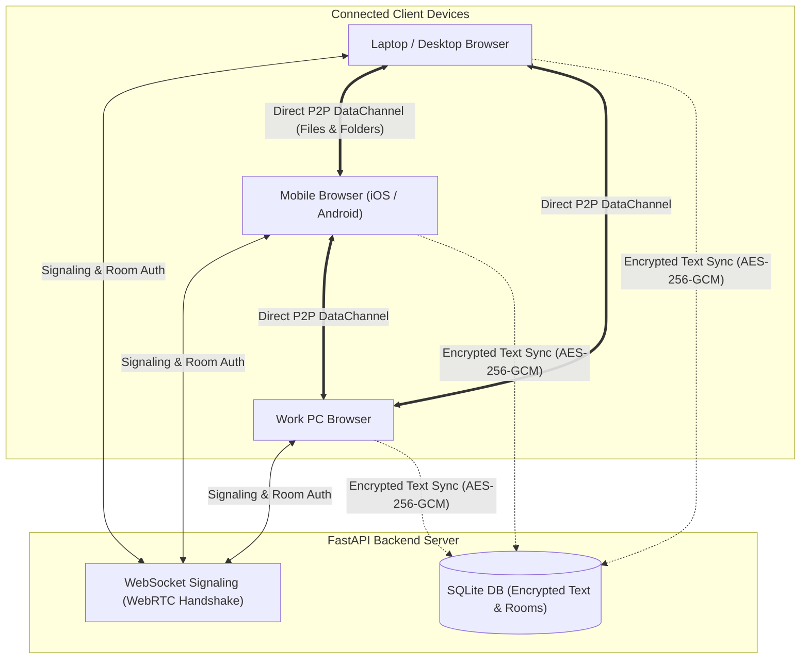

# Product Specification: Cross-Device P2P Hub & Encrypted Vault

## 1. Overview
A browser-accessible, cross-device P2P workspace that allows seamless pairing between personal laptops, smartphones, work PCs, and other devices. It combines direct, high-speed **WebRTC peer-to-peer data transfers** (files, folders, media, live chat) with an **end-to-end encrypted persistent text/note storage** (backed by SQLite) accessible without active peer sessions.

---

## 2. Technology Stack & Design Decisions
- **Backend:** **Python (FastAPI + Uvicorn + WebSockets + SQLite)**
  - Fast, asynchronous WebSocket signaling for WebRTC peer coordination.
  - Built-in SQLite database storing encrypted text/notes and persistent room metadata.
  - Single backend process running both the signaling server and REST/WebSocket APIs.
- **Frontend:** **React + TypeScript + Tailwind CSS (Vite)**
  - Component-driven architecture for multi-peer state, transfer progress bars, vault modal, and chat timeline.
  - Strict TypeScript interfaces for WebRTC signaling payloads, binary chunk streams, and AES-256-GCM encryption schemas.
  - Tailwind CSS configured with custom Cyber-HUD tokens (Neon Cyan `#00FFFF`, Deep Obsidian `#050608`, Glassmorphism, and HUD glow utilities).
  - High-performance Vite dev server and production builder.
- **P2P Engine:** WebRTC DataChannels (`RTCDataChannel`) with STUN/TURN fallback.

---

## 3. UI/UX Design System: "Cyber-HUD" Futuristic Theme
- **Color Palette:**
  - **Background:** Deep Obsidian Black (`#050608`), Dark Void Panel (`#0B0E14`), and Frosted Glass (`rgba(11, 14, 20, 0.85)` with `backdrop-filter: blur(14px)`).
  - **Primary Accent:** Electric Cyber Cyan (`#00FFFF` / `hsl(180, 100%, 50%)`) for active states, neon accents, interactive glows, and connection pulses.
  - **Text & Contrast:** Pure Crisp White (`#FFFFFF`) for primary titles, crisp labels, and active messages; Cool Slate (`#8E9BAE`) for secondary metadata.
  - **Status Accents:** Emerald Matrix Green (`#00FF88`) for active P2P links, Amber Warning (`#FFB800`), Neon Crimson (`#FF3366`) for errors.
- **Typography & Geometry:**
  - High-tech geometric & monospace typography (`Space Grotesk` + `JetBrains Mono` from Google Fonts).
  - Subtle glowing borders (`box-shadow: 0 0 15px rgba(0, 255, 255, 0.15)`), HUD status brackets, and clean glassmorphism cards.
  - Animated live radar/pulse for active P2P nodes and real-time streaming speedometers.

---

## 3. Core Features & Specifications

### 3.1. Persistent Rooms & Device Pairing
- **Persistent Personal Space:**
  - Rooms persist across browser reloads and device reboots.
  - Room protected by a user-defined passphrase / secret token.
  - Dynamic QR code generation for 1-second pairing from mobile phones.
  - Short code (e.g., `room-4829`) or direct secret link (`/room/xyz#passphrase`) for PC/laptop pairing.
- **Multi-Device State Tracking:**
  - Real-time online/offline peer indicators (e.g., "Personal Laptop - Online", "Work PC - Online", "Phone - Offline").

### 3.2. Persistent Encrypted Vault (Notes & Small Files/Credentials)
- **Zero-Knowledge Client-Side Encryption:**
  - AES-256-GCM encryption with key derived from room passphrase (PBKDF2 / Web Crypto API).
  - The server and SQLite database store only opaque ciphertext.
- **Supported Vault Item Types:**
  - **Encrypted Notes & Code Snippets:** Plain text, JSON, environment variables, markdown.
  - **Encrypted Small File Vault (Up to 10 MB):** Store certificates, SSH keys, `.env` files, or critical documents directly inside SQLite with zero-knowledge encryption, accessible anytime even when all other peer devices are powered off.
- **Offline & Cross-Device Availability:**
  - Stored permanently in SQLite until deleted by user; synchronizes securely to any device entering the room with the correct passphrase.

### 3.3. ToffeeShare-Style P2P File & Folder Sharing (Real-Time Transfer)
- **Direct P2P Data Streaming:**
  - WebRTC DataChannel transfers directly between devices with zero cloud file storage and zero file size limits.
  - High-speed local transfers when devices are on the same Wi-Fi / LAN.
- **Supported File Types:**
  - Images, videos, PDFs, documents, large installers, archives.
- **Folder Transfer Strategy:**
  - **Browser-Native In-Flight Bundling:** When a user drops a folder, the browser preserves the folder hierarchy and streams it as a structured archive (ZIP) without requiring server involvement or native apps. Compatible with mobile and desktop browsers alike.
- **Instant Camera & Screen Capture:**
  - **Mobile:** One-tap "Take Photo & Send" to capture and beam camera shots directly over P2P without manual gallery saving.
  - **Desktop:** One-click "Capture Screen / Window" to snap and transfer a screenshot or screen snippet instantly.
- **Transfer Controls & UX:**
  - Real-time progress bars, transfer speed indicators (MB/s), estimated completion time, and cancel/retry options.

### 3.4. 1-Click Clipboard Sharing (Zero OS Configuration)
- **Browser-Native Clipboard Integration:**
  - No background apps, scripts, or OS changes required on phone or PC.
  - **"Send Clipboard" Button:** One click reads your clipboard and sends it immediately to the room / active peers.
  - **"Copy to Clipboard" Button:** One click on any message/text snippet copies it to the device clipboard.

### 3.5. Device Identity & Notification Alerts
- **Device Nicknames:**
  - Auto-detected default (e.g., "Windows PC", "Android Phone", "MacBook") with an option to customize (e.g., "Work Laptop", "Personal Phone").
  - Badges displaying which specific device sent each file or note.
- **Audio & Haptic Alerts:**
  - Subtle audio chime and mobile haptic vibration when a file transfer finishes or a new message/note is received.

---

## 4. System Architecture

---

## 5. Potential Brainstorming & Extension Ideas
Here are areas we can explore and expand upon:

1. **Clipboard Sync:** Instant auto-sync / one-click sync button for system clipboards.
2. **Local Network (LAN) Optimization:** Direct local IP detection for ultra-fast multi-gigabit transfers over home/office Wi-Fi without leaving the local network.
3. **Ephemeral vs Persistent Rooms:** Persistent personal room (e.g. pinned with a master passphrase) vs ephemeral 1-time throwaway rooms.
4. **Media Streaming Preview:** Stream video/audio files directly as they download without waiting for the full file to finish.
5. **Folder Transfer UX:** Drag-and-drop whole folders with automatic zip or direct chunked recursive tree reconstruction.
6. **Self-Hosting / Standalone Binary:** Easy packaging (e.g., Node.js / Go / Rust / Python) with zero complex external dependencies.
7. **End-to-End Key Exchange:** Diffie-Hellman (ECDH) key exchange over signaling to guarantee zero eavesdropping even on signaling server.
